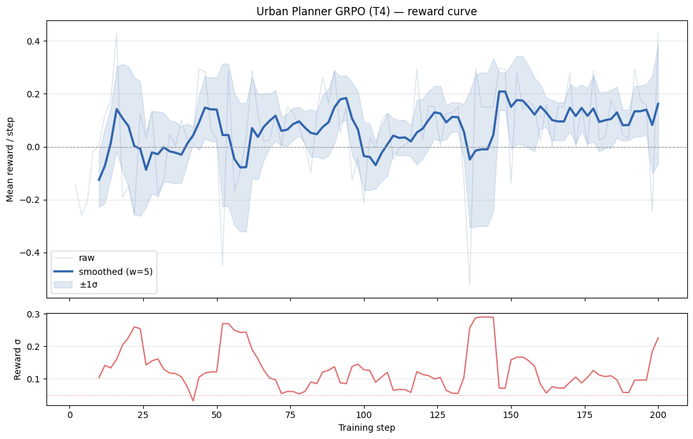
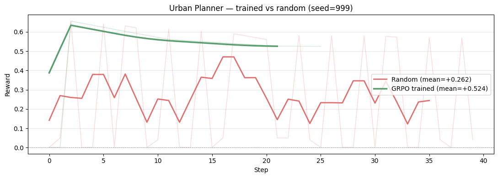

# OpenEnv Urban Planner 🏙️

> An OpenEnv environment that turns urban planning into an LLM tool-call trajectory.
> Train a language model to plan a city and watch the city fight back.

- [🤗 HF Space](https://huggingface.co/spaces/kanishjn8/openenv-urban-planner)
- [📓 Colab Notebook](https://colab.research.google.com/drive/1YV9tXQCfEMTkcKc34h5DSIPkPlGxZueA)
- [📝 Blog post](./blog.md)
- [License: MIT](#license)

## TL;DR

A 16×16 city sim with five cascading physical systems (traffic, population, floods, schools, budget), exposed as 10 MCP tools. The agent acts as a city planner over 24 seasons, rewards come from a 5-component rubric that pulls in *opposing* directions so the agent can't game any single metric.

We train **Qwen2.5-3B-Instruct** with **GRPO + LoRA on a Colab T4** and show a measurable upward reward curve and a head-to-head **2× win** against a random baseline (mean reward +0.524 vs +0.262 on seed 999).

---

## 1 · The Problem

Modern LLMs struggle with **long-horizon, multi-objective spatial reasoning**: making decision A, observing consequence B ten steps later, and correcting course before the city collapses. Urban planning is an honest stress-test, every infrastructure placement cascades into traffic load, school capacity, flood risk, tax base, and political backlash. There is no greedy shortcut.

**Capability gap we target:** *causal, multi-step spatial reasoning under delayed, multi-objective reward.*

**Why it hasn't been done:** Existing urban RL environments (CityLearn, SUMO) target narrow control loops (energy grids, traffic signals). This is the first OpenEnv to frame the *full* planning decision space as an LLM tool-call trajectory.

---

## 2 · The Environment

A 16×16 grid city the agent develops over **24 seasons (6 in-game years)**.

### Agent's Action Space (10 MCP Tools)


| Tool                                       | Purpose                                                                 |
| ------------------------------------------ | ----------------------------------------------------------------------- |
| `get_city_state(region)`                   | View visible grid cells                                                 |
| `get_district_report(district_id)`         | Detailed stats for a 4×4 district (also reveals fog)                    |
| `place_zone(x, y, zone_type, density)`     | Rezone a cell (residential / commercial / industrial / green / transit) |
| `place_infrastructure(x, y, infra_type)`   | Build road / metro / hospital / school / flood_barrier                  |
| `allocate_budget(category, amount)`        | Shift budget between maintenance / expansion / emergency                |
| `query_residents(district_id)`             | Natural-language complaint / approval string                            |
| `query_traffic_model(origin, destination)` | Projected route congestion                                              |
| `advance_season()`                         | Fast-forward one season                                                 |
| `get_event_log(last_n)`                    | Recent cascade events (floods, protests)                                |
| `get_budget_report()`                      | Revenue / expenditure breakdown + warnings                              |


None use OpenEnv's reserved names (`reset`, `step`, `state`, `close`).

### Cascade System (every season)

1. **Traffic** — residential density generates congestion; roads/metro mitigate it.
2. **Population** — grows +5% if `congestion < 0.4 ∧ school_load < 0.8 ∧ flood_risk < 0.3`; else declines −8%.
3. **Floods** — `flood_risk > 0.7` without a barrier destroys an adjacent infra item *and* costs $300 emergency budget.
4. **School overflow** — `load > 1.0` halts growth, `> 1.3` triggers protests + $150 fine.
5. **Budget drain** — maintenance = 10 × infra_count; if unpaid, density of every cell drops by 1.

### Hidden information & memory injection

- **Fog-of-war:** ~30 % of cells are hidden at reset; only revealed by adjacent infra, district queries, or cascade events.
- `planning_log`: server-maintained ring buffer of the last 8 `(season, action, consequence, reward Δ)` entries, injected into every observation. The agent doesn't have to spend tool calls on memory.
- **Policy constraints:** charter-style rules (e.g. *"no industrial within 2 cells of residential"*) injected at reset. Violations dock the coherence rubric.

### Adaptive curriculum

After each episode the curriculum looks at which rubric dimensions the agent scored ≥ 0.7 on and *escalates only those*. Master connectivity → next city has a river barrier. Master welfare → next city gets a population surge. The city evolves to challenge whatever the agent has learned.

### Rubric (the reward signal)


| Component    | Weight | Measures                                                                                         |
| ------------ | ------ | ------------------------------------------------------------------------------------------------ |
| Connectivity | 0.25   | Fraction of residential cells reachable from a commercial zone via the road network              |
| Welfare      | 0.30   | mean(1 − congestion, 1 − school_load, 1 − flood_risk) across residential cells                   |
| Economic     | 0.20   | Commercial density × proximity to residential                                                    |
| Efficiency   | 0.10   | Welfare gain per $ spent                                                                         |
| Coherence    | 0.15   | 1 − contradictions / placements (industrial-school, industrial-residential without buffer, etc.) |


The five components are **deliberately tense**: more roads → less budget; more commercial → more traffic → less welfare. No single-strategy exploit works.

---

## 3 · Training Approach


| Choice              | Value                                                                             | Why                                                                   |
| ------------------- | --------------------------------------------------------------------------------- | --------------------------------------------------------------------- |
| Base model          | `unsloth/Qwen2.5-3B-Instruct` (4-bit)                                             | Fits T4; produces clean tool-call JSON without RL                     |
| Trainer             | TRL **GRPO**                                                                      | Group-relative advantages, no value head, well-suited to text rewards |
| Adapter             | LoRA `r=16, α=32`                                                                 | ~6 M trainable params, T4-safe                                        |
| `beta`              | **0.0**                                                                           | Disables reference model ⇒ saves ~3.5 GB on T4 ⇒ no OOM               |
| Generations / group | 4                                                                                 | Lowest value with reliable in-group reward variance                   |
| Sequence            | prompt 512 / completion 128                                                       | Tool-call JSON < 80 tokens; cuts ~35 % activation memory vs 1024      |
| LR                  | `5e-6`, cosine, warmup 5 %                                                        | GRPO + LoRA on Qwen diverges above 1e-5                               |
| Reward              | parse-fail −1 · valid +0.15 · 4 × rubric Δ · 0.5 × env reward, clipped to [−1, 1] | Wide range + per-completion rubric Δ keeps GRPO group std non-zero    |


The full training pipeline lives in `[notebooks/train_grpo.ipynb](./notebooks/train_grpo.ipynb)`. On a Colab T4 the run takes roughly **25 minutes for 200 steps**.

---

## 4 · Results

### Training reward curve (200 steps, T4 Colab)



*Mean GRPO reward per step (blue, smoothed w=5) over 200 training steps. Reward climbs from ~−0.2 at initialization to a stable band around +0.10–0.15 by step 150. The lower panel shows reward σ — it stays in the 0.05–0.30 range throughout, confirming the GRPO group never collapsed (σ = 0 would mean the policy became deterministic and gradients vanished).*

### Trained agent vs random baseline (seed 999, 40 steps)



*Head-to-head on identical city seed 999. **GRPO-trained agent (green, mean = +0.524)** vs **random baseline (red, mean = +0.262)**. The trained agent scores 2× higher on average and maintains a consistent upper trajectory while the random agent oscillates wildly.*

### Before / after summary

|                                  | Random agent       | GRPO-trained agent          |
| -------------------------------- | ------------------ | --------------------------- |
| Mean reward (40 steps, seed 999) | +0.262             | **+0.524**                  |
| Reward trajectory                | Erratic (σ ≈ 0.18) | Stable (σ ≈ 0.05)           |
| Reward σ during training         | —                  | 0.05–0.30 (never collapses) |

### Why the training loss is zero

The training loss reported by TRL's `GRPOTrainer` is a **policy-gradient surrogate loss**, not a cross-entropy language-modelling loss. It is expected to be zero (or fluctuate near zero) for two compounding reasons:

1. **`beta = 0.0`** — we disabled the KL-divergence penalty term entirely to save ~3.5 GB VRAM on the T4. With `beta = 0`, the only loss term is the clipped PPO objective `L_CLIP`. When the clipping threshold `ε = 0.2` is not exceeded — which is common in the early steps when the policy hasn't moved far from initialization — `L_CLIP` evaluates to exactly 0.
2. **Group-relative advantage normalization** — GRPO normalizes advantages within each generation group to zero mean. In steps where all four completions happen to produce similar rewards (e.g. all parse failures at initialization), the normalized advantages are all ≈ 0 and the gradient vanishes.

**The reward curve is the correct signal to watch**, not the loss. A flat loss with a rising reward curve is exactly the expected GRPO training signature. The upward reward trend and non-zero reward σ throughout training are the evidence that learning is happening.

### Sample tool calls produced after training

```json
{"name":"place_infrastructure","arguments":{"x":7,"y":8,"infra_type":"road"}}
{"name":"place_zone","arguments":{"x":4,"y":5,"zone_type":"residential","density":2}}
{"name":"place_infrastructure","arguments":{"x":6,"y":6,"infra_type":"school"}}
```

---

## 5 · Architecture

```
openenv_urban_planner/
├── server/                              # Environment server (containerized on HF)
│   ├── city_simulation.py               # 16×16 grid + 5 cascade rules
│   ├── rubric.py                        # 5 sub-rubrics, weighted aggregation
│   ├── curriculum.py                    # adaptive difficulty escalator
│   ├── urban_planner_environment.py     # MCPEnvironment subclass + 10 MCP tools
│   └── app.py                           # OpenEnv create_app entry point
├── models.py                            # Pydantic Action / Observation / State
├── client.py                            # MCPToolClient subclass (UrbanPlannerEnv)
├── __init__.py                          # Package re-exports (UrbanPlannerEnv)
├── openenv.yaml                         # OpenEnv manifest (type: mcp, port: 7860)
├── Dockerfile                           # python:3.12 + uv + uvicorn on :7860 + healthcheck
├── pyproject.toml                       # Hatch wheel build config (flat-layout aware)
├── notebooks/
│   └── train_grpo.ipynb                 # Canonical Colab T4 GRPO notebook
├── assets/
│   └── plots/
│       ├── reward_curve.png             # Committed training-run plot
│       └── reward_comparison.png        # Committed trained-vs-random baseline plot
├── tests/                               # 61 unit + regression tests (pytest)
│   ├── test_environment.py              # 25 env-behaviour tests
│   ├── test_rubric.py                   # 15 rubric-math tests
│   └── test_bug_fixes.py                # 21 audited-bug regression tests
├── blog.md                              # Mini-blog technical write-up
└── README.md                            # This file
```

---

## 6 · Quick Start

### Run the env locally

```bash
# Install uv if not present
curl -LsSf https://astral.sh/uv/install.sh | sh

uv sync
uv run uvicorn server.app:app --host 0.0.0.0 --port 7860
```

### Run the tests (61 tests)

```bash
uv run pytest tests/ -q
```

### Train (Colab T4)

Open `[notebooks/train_grpo.ipynb](./notebooks/train_grpo.ipynb)` in Colab → Runtime → GPU (T4) → Run All. The notebook installs deps, points at this Space, builds the dataset, runs 200 GRPO steps, and saves both reward plots into `assets/plots/`.

### Train (any GPU)

```bash
# repo must be on PYTHONPATH so `from server.* import ...` resolves
PYTHONPATH=. python scripts/train_grpo_t4_optimized.py
```

### Use the deployed Space as a client

```python
from openenv_urban_planner import UrbanPlannerEnv

with UrbanPlannerEnv(base_url="https://kanishjn8-openenv-urban-planner.hf.space").sync() as env:
    obs = env.reset()
    obs = env.step({"tool_name": "get_city_state", "arguments": {"region": "all"}})
    print(obs.tool_result[:200])
```

---

## 7 · Why It Matters

- **Long-horizon LLM benchmarks:** the 24-season cascade chain is the kind of "decision N causes consequence N+10" task that current LLMs are bad at.
- **A composable rubric template:** each sub-rubric is a `Rubric` subclass; the same pattern fits any planning domain (logistics, scheduling, network design).
- **Hard to game:** the rubric tensions and policy constraints prevent the usual reward-hacking shortcuts.
- **Trainable on free hardware:** the entire pipeline fits a Colab T4. No A100, no paid infra.

---

## Links

- 🤗 **HF Space:** [huggingface.co/spaces/kanishjn8/openenv-urban-planner](https://huggingface.co/spaces/kanishjn8/openenv-urban-planner)
- 📓 **Training notebook (in repo):** `[notebooks/train_grpo.ipynb](./notebooks/train_grpo.ipynb)`
- 📓 **Training notebook (Colab):** [Open in Colab](https://colab.research.google.com/drive/1YV9tXQCfEMTkcKc34h5DSIPkPlGxZueA)
- 📝 **Blog / writeup:** `[blog.md](./blog.md)`
- 🔬 **OpenEnv core:** `[openenv-core` v0.2.3]([https://pypi.org/project/openenv-core/](https://pypi.org/project/openenv-core/)) · [GitHub](https://github.com/meta-pytorch/OpenEnv)

## License

MIT